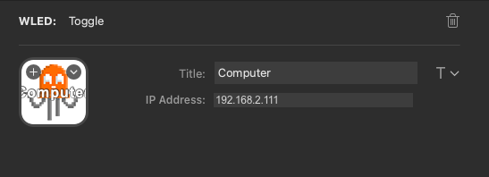

# Stream Deck WLED Plugin

This is a plugin for [WLED](https://kno.wled.ge/).

## Description

This is in very early stages of development. However, so far
you can:

 - toggle the power of a WLED source.
 - select the scene of a WLED source.
 - select the preset of a WLED source.

## Screenshots

## Features

 - code written in Javascript
 - cross-platform (macOS, Windows)

## Assumptions

This plugin assumes that you already have a working WLED setup. This plugin will communicate to WLED over the local network and use the [JSON API](https://kno.wled.ge/interfaces/json-api/) provided by WLED. I'm not sure how far back the WLED Firmware will work with this plugin, but I've tested with these versions

  - v0.14.0.b2
  - v0.14.0.b1
  - v0.13.3
