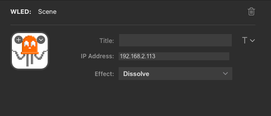

# Stream Deck WLED Plugin

This is a plugin for [WLED](https://kno.wled.ge/).

## Description

This is in very early stages of development. However, so far
you can:

 - toggle the power of a WLED source.
 - select the effect of a WLED source.

## Features

 - code written in Javascript
 - cross-platform (macOS, Windows)

## Assumptions

This plugin assumes that you already have a working WLED setup. This plugin will communicate to WLED over the local network and use the [JSON API](https://kno.wled.ge/interfaces/json-api/) provided by WLED.